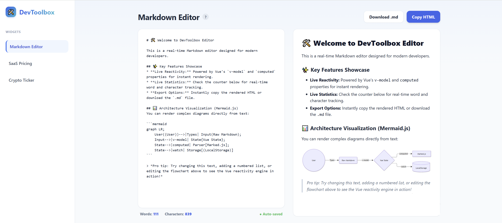
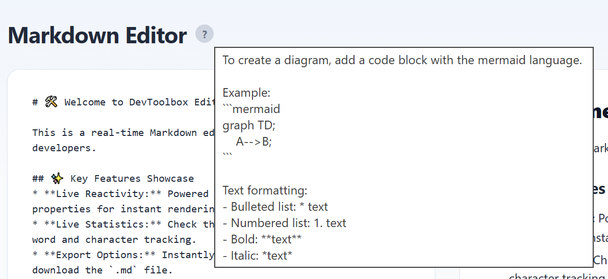
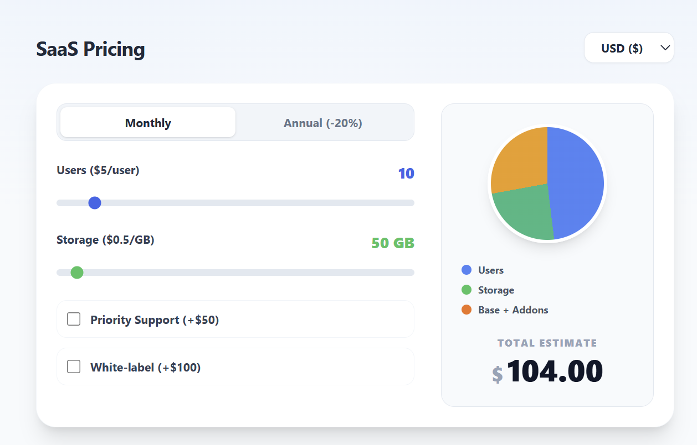
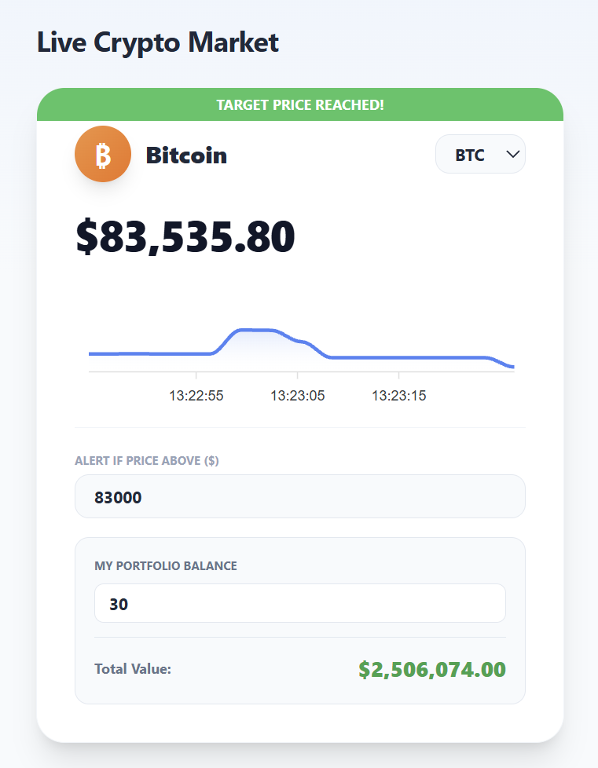

# 🛠️ DevToolbox – Developer Productivity Dashboard

> A modern, pixel-perfect developer dashboard built with Vue 3 (Composition API) and Tailwind CSS. It features a Scandinavian minimalist UI and encapsulates advanced frontend patterns including reactive state management, custom directives, composables, and seamless third-party API integrations.

---

## 📸 App Showcase

### 1. Markdown Editor & Live Rendering
> Real-time Markdown parsing with persistent state and live word/character tracking.

### 2. Custom Directives & Tooltips
> Implementation of a custom Vue directive (`v-tooltip`) providing helpful contextual information.

### 3. SaaS Pricing Calculator
> Reactive estimation engine with multi-currency support, interactive sliders, and dynamic CSS pie charts.

### 4. Crypto Ticker & Portfolio
> Live financial tracking connected to the Binance REST API, featuring ApexCharts historical data and portfolio calculations.

---

## 🚀 Key Features

### 📝 1. Real-Time Markdown Editor
An advanced text editor designed for technical documentation and architecture planning.
- **Live Reactivity:** Instant HTML rendering powered by Vue's `v-model` and `computed` properties.
- **Architecture Visualization:** Native support for rendering complex flowcharts and diagrams directly from text using **Mermaid.js**.
- **Persistent State:** Drafts are automatically saved to `localStorage` to prevent data loss.
- **Productivity Tools:** Live word/character tracking, HTML clipboard copying, and direct `.md` file downloads.

### 💰 2. SaaS Pricing Calculator
A dynamic, reactive pricing estimation engine for software services.
- **Multi-Currency Support:** Real-time conversion between USD, EUR, and GBP.
- **Interactive Metrics:** Range sliders for user seats and storage caps with automated add-on toggles.
- **Cost Visualization:** Dynamic CSS `conic-gradient` pie charts instantly visualize the cost breakdown between base fees, storage, and active users.

### 📈 3. Live Crypto Market & Portfolio
A real-time financial tracking widget connected to external data sources.
- **Live API Polling:** Fetches real-time cryptocurrency data from the Binance REST API.
- **Historical Charting:** Visualizes localized market trends using **ApexCharts** (Area sparklines mapped to temporal data).
- **Portfolio Management:** Calculates active total portfolio value based on live token prices.
- **Custom Alerts:** Users can set target thresholds to trigger dynamic UI alerts when prices surge.

---

## 🛠️ Tech Stack & Architecture

- **Framework:** Vue 3 (Composition API, `<script setup>`)
- **Build Tool:** Vite (for lightning-fast HMR and optimized bundling)
- **Styling:** Tailwind CSS (Scandinavian light-theme minimalism)
- **Data Visualization:** ApexCharts (`vue3-apexcharts`), Mermaid.js
- **Markdown Parsing:** Marked.js
- **Architecture Patterns:** Vue Provide/Inject (Global Toast System), Custom Composables (`useMarkdown`, `useCrypto`), Custom Directives (`v-tooltip`).
